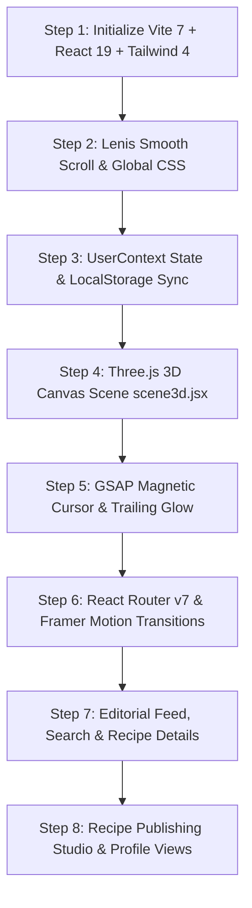

# Step-by-Step Rebuild Guide: Gourmet Restaurant Hub

```mermaid
flowchart TD
    S1[Step 1: Initialize Vite 7 + React 19 + Tailwind 4] --> S2[Step 2: Lenis Smooth Scroll & Global CSS]
    S2 --> S3[Step 3: UserContext State & LocalStorage Sync]
    S3 --> S4[Step 4: Three.js 3D Canvas Scene scene3d.jsx]
    S4 --> S5[Step 5: GSAP Magnetic Cursor & Trailing Glow]
    S5 --> S6[Step 6: React Router v7 & Framer Motion Transitions]
    S6 --> S7[Step 7: Editorial Feed, Search & Recipe Details]
    S7 --> S8[Step 8: Recipe Publishing Studio & Profile Views]
```
